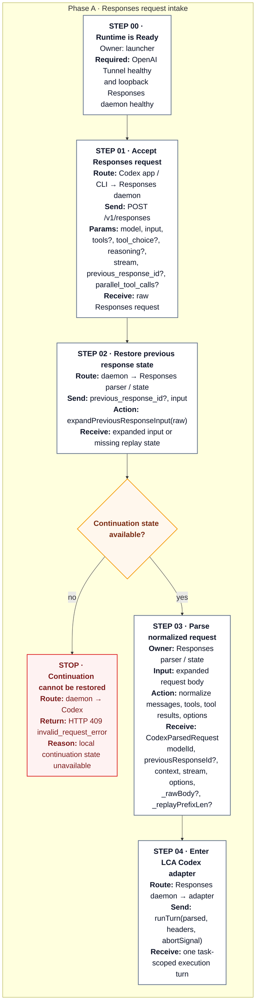
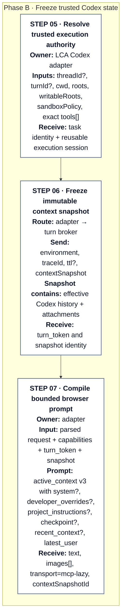
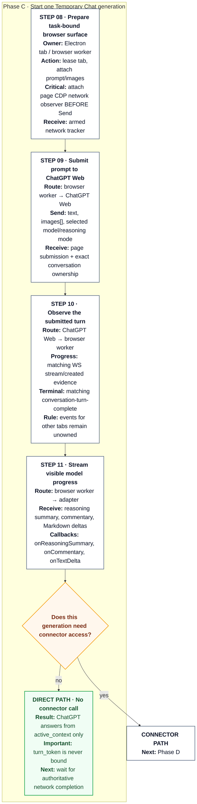
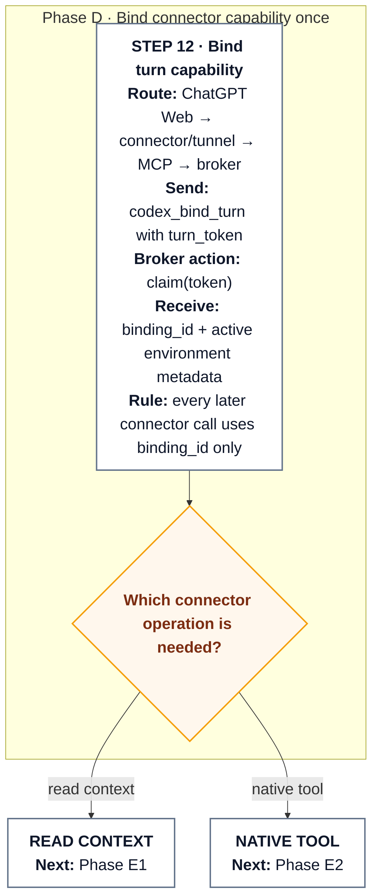
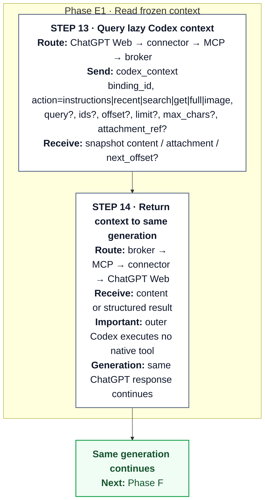
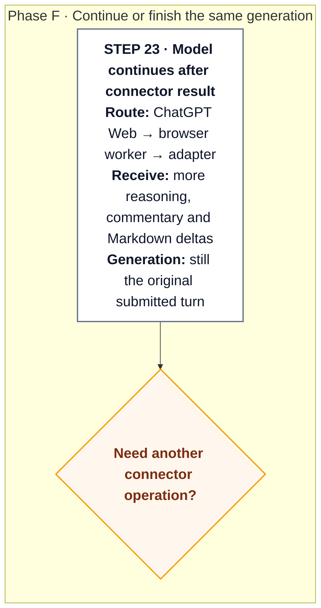

# Architecture

```text
Codex app / CLI
      │ Responses API on loopback
      ▼
launcher-owned lca-codex daemon
  ├─ official /models passthrough + fixed LCA Codex models
  ├─ native Responses passthrough or ChatGPT Responses/SSE bridge
  ├─ ChatGPT browser worker (up to five task-bound Electron tabs)
  ├─ capability broker
  └─ stdio MCP server
            ▲
            │ outbound OpenAI Tunnel
            ▼


      ChatGPT custom connector
```

## Runtime contract

LCA Codex has one supported runtime shape: the ChatGPT Web bridge. Codex remains the only agent
harness; LCA transports a selected turn to ChatGPT Web and connects that response back to the
current Codex task.

- Exposes one `lca-codex` model. Its reasoning selector maps Low/Medium/High/Extra High/Pro to the
  matching ChatGPT browser reasoning mode; Extra High and Pro are advertised only when the
  authenticated account exposes Pro.
- Instant, Medium, High, Extra High, and Pro are all tool-capable when the custom connector is
  enabled. Reasoning effort selects the ChatGPT browser mode; it does not independently change
  local-tool access. An explicitly connector-disabled runtime remains read-only regardless of
  reasoning level.
- ChatGPT uses a required custom MCP connector backed by `openai/tunnel-client`.
- Every connector call is bound to one outer Codex turn capability.
- Tool calls and results remain in the same ChatGPT response while Codex executes them locally.
- Runtime readiness is conjunctive: both the tunnel and the Responses daemon must be healthy. The
  launcher starts the tunnel first and never reports the runtime Ready when tunnel readiness is lost.

### Browser response transport

The ChatGPT-to-Codex return path is deliberately hybrid. Page-scoped ChatGPT HTTP requests establish
submission and conversation ownership, while matching WebSocket traffic supplies lifecycle signals;
neither is the text transport. The worker separately polls the
public assistant DOM for visible reasoning/commentary and semantic Markdown, then the Responses bridge
encodes those append-only deltas as SSE/JSON for Codex. In compact form:

```text
ChatGPT page HTTP ── submission / conversation ownership ──────┐
ChatGPT WebSocket ── lifecycle / terminal completion ──────────┼─ browser worker ── Responses SSE/JSON ──▶ Codex
ChatGPT DOM polling ── visible trace + semantic Markdown ───────┘
```

The page's conversation POST proves that its submission left the composer. The same page's
`stream_status` request supplies the exact conversation ID, including for Instant mode where no
`conversation-turn-stream` event is emitted. WebSocket `conversation-created`,
`conversation-turn-stream`, and `conversation-turn-complete` evidence is buffered until it matches that
page-owned ID. A completion for an unrelated conversation is ignored. A completion carrying a turn ID
must match the exact owned turn; matching conversation creation never overrides a conflicting turn ID.

The reversible Codex integration deliberately installs a Web-compatibility profile:
`multi_agent = true` preserves routed subagent turns, `multi_agent_v2 = false` keeps their payloads
readable by the current Web projection, and `remote_compaction_v2 = false` bounds retained Web image
history. These settings adapt the outer Codex harness to ChatGPT Web constraints; they do not move
planning, tool ownership, sandboxing, or approvals into LCA Codex.

## End-to-end request flow

The top-level diagram shows the components, but a normal routed turn crosses them in a specific
order. The detailed flow below is split into narrow, vertically stacked phase diagrams so Mermaid does not
shrink one wide multi-branch SVG to fit the page. Every card still shows the route, representative
parameters sent, and the result received. The launcher must already have both
the outbound tunnel and the loopback Responses daemon in the Ready state before Codex sends work to
`lca-codex`.



### Phase B - Freeze trusted Codex state



### Phase C - Start one Temporary Chat generation



### Phase D - Bind connector capability once



### Phase E1 - Read frozen context



### Phase E2 - Execute an exact native Codex tool

```mermaid
%%{init: {"themeVariables": {"fontSize": "22px"}, "flowchart": {"htmlLabels": true, "useMaxWidth": false}}}%%
flowchart TD
    classDef card fill:#ffffff,stroke:#64748b,stroke-width:2px,color:#0f172a,font-size:22px
    classDef note fill:#f8fafc,stroke:#94a3b8,stroke-width:1.5px,color:#334155,font-size:20px
    classDef success fill:#f0fdf4,stroke:#16a34a,stroke-width:2px,color:#14532d,font-size:22px

    subgraph PE2["Phase E2 · Execute an exact native Codex tool"]
        direction TB
        S15["<b>STEP 15 · Request native tool invocation</b><br/><b>Route:</b> ChatGPT Web → connector → MCP → broker<br/><b>Send:</b> binding_id + exact native request<br/>examples: cmd, patch, or wire_name + arguments? / input?<br/><b>Broker:</b> invoke(bindingId, wireName, ...)"]:::card
        S16["<b>STEP 16 · Broker blocks connector request</b><br/><b>Owner:</b> turn broker<br/><b>Action:</b> allocate call_id and queue BrokerToolRequest<br/><b>Payload:</b> callId, wireName, freeform, arguments? / input?<br/><b>Important:</b> original MCP request stays open"]:::card
        S17["<b>STEP 17 · Surface Responses function_call to Codex</b><br/><b>Route:</b> broker → adapter → Responses daemon → Codex<br/><b>Events:</b> tool_call_start, tool_call_delta, tool_call_end<br/><b>Responses output:</b> function_call with call_id, name, arguments<br/><b>Turn state:</b> response.completed with endTurn=false"]:::card
        N17["<b>Parallel batch rule</b><br/>A batch may contain multiple call_id values.<br/>Every outstanding call_id must receive a result<br/>before the browser generation can resume."]:::note
        S18["<b>STEP 18 · Outer Codex executes the exact tool</b><br/><b>Owner:</b> Codex harness<br/><b>Authority:</b> native tool registry, sandbox, approvals,<br/>session lifecycle and local side effects<br/><b>Receive:</b> native tool result for each call_id"]:::card
        S19["<b>STEP 19 · Post function_call_output continuation</b><br/><b>Route:</b> Codex → Responses daemon<br/><b>Send:</b> POST /v1/responses<br/><b>Params:</b> previous_response_id + input[] containing<br/>function_call_output with call_id + output, stream<br/><b>Receive:</b> continuation request"]:::card
        S20["<b>STEP 20 · Parse returned toolResult messages</b><br/><b>Route:</b> daemon → parser → adapter<br/><b>Receive:</b> toolResult with toolCallId, toolName,<br/>toolNamespace?, content, isError?<br/><b>Session:</b> reuse existing execution session and outstanding batch"]:::card
        S21["<b>STEP 21 · Complete blocked broker invocation</b><br/><b>Route:</b> adapter → broker<br/><b>Send:</b> completeTool(turn_token, call_id, result)<br/><b>Result:</b> content, structuredContent?, isError?<br/><b>Receive:</b> original blocked MCP invoke resolves"]:::card
        S22["<b>STEP 22 · Return tool result to ChatGPT</b><br/><b>Route:</b> broker → MCP → connector → ChatGPT Web<br/><b>Receive:</b> connector tool result<br/><b>Critical:</b> SAME browser response/generation resumes<br/><b>Never:</b> no replacement Temporary Chat for this round-trip"]:::card
    end

    S15 --> S16 --> S17 --> S18 --> S19 --> S20 --> S21 --> S22
    S17 -. "parallel batch" .-> N17
    S22 --> N22["<b>SAME browser generation resumes</b><br/><b>Next:</b> Phase F"]:::success
```



### Phase F - Continue or finish the same generation



### Phase G - Authoritative completion and Responses encoding

```mermaid
%%{init: {"themeVariables": {"fontSize": "22px"}, "flowchart": {"htmlLabels": true, "useMaxWidth": false}}}%%
flowchart TD
    classDef card fill:#ffffff,stroke:#64748b,stroke-width:2px,color:#0f172a,font-size:22px
    classDef decision fill:#fff7ed,stroke:#f59e0b,stroke-width:2px,color:#7c2d12,font-size:22px
    classDef success fill:#f0fdf4,stroke:#16a34a,stroke-width:2px,color:#14532d,font-size:22px
    classDef error fill:#fef2f2,stroke:#dc2626,stroke-width:2px,color:#7f1d1d,font-size:22px

    subgraph PG["Phase G · Authoritative completion and Responses encoding"]
        direction TB
        Q24{"<b>How does the browser turn terminate?</b>"}:::decision
        S24["<b>STEP 24 · Resolve terminal lifecycle</b><br/><b>Authority:</b> owned conversation-turn-complete only<br/><b>Terminal render read:</b> re-snapshot the canonical answer DOM once at the network terminal edge<br/><b>Rule:</b> no fixed post-network settle timer; DOM never creates completion"]:::card
        S25["<b>STEP 25 · Flush final browser outcome</b><br/><b>Owner:</b> browser worker / adapter<br/><b>All turns:</b> append structurally complete, stable semantic answer blocks during generation<br/><b>Terminal:</b> flush only the remaining canonical Markdown tail"]:::card
        S26["<b>STEP 26 · Revoke turn capability</b><br/><b>Route:</b> adapter → turn broker<br/><b>Action:</b> retire turn_token + binding_id<br/><b>Result:</b> reject later or still-pending connector use"]:::card
        S27["<b>STEP 27 · Encode final Responses result</b><br/><b>Route:</b> adapter → daemon → Codex<br/><b>If stream=true:</b> SSE reasoning/text/output_item events,<br/>then response.completed with output + usage<br/><b>If stream=false:</b> completed JSON Responses object"]:::success
        S28["<b>STEP 28 · Remember bounded continuation state</b><br/><b>Route:</b> daemon → Responses state<br/><b>Send:</b> raw request + completed response<br/><b>Result:</b> future previous_response_id can restore this turn"]:::card
        E24["<b>TERMINAL ERROR / INCOMPLETE</b><br/><b>Route:</b> adapter / daemon → Codex<br/><b>Return:</b> response.failed or response.incomplete<br/><b>Cleanup:</b> active turn capability is still revoked"]:::error
    end

    Q24 -- "network lifecycle completion" --> S24 --> S25 --> S26 --> S27 --> S28
    Q24 -- "failure or incomplete" --> E24
```



Payloads in the diagram are intentionally representative rather than exhaustive schemas: field names
match the wire or internal structures used by the implementation, while optional fields that do not
change the lifecycle are omitted. The key IDs are distinct: `previous_response_id` chains Responses
requests, `turn_token` is the turn-scoped capability accepted only by the bind step, `binding_id` is returned by
`codex_bind_turn`, and each native invocation receives its own `call_id` that must match the later
`function_call_output`.

The important property of the tool path is that ChatGPT does not execute repository tools itself.
The connector call blocks in the local broker while the adapter surfaces an ordinary Responses tool
call to the outer Codex harness. Codex performs that call with the exact tool registry, sandbox, and
approval policy attached to the active turn. When Codex posts the tool result back, the existing
browser response resumes; LCA Codex does not start a second planner or a replacement ChatGPT turn for
the tool round-trip.

Normal completion is network-authoritative. The browser worker accepts a valid
`conversation-turn-complete` observed after the tracker was armed and does not add a fixed terminal
settle delay. At that network terminal edge it re-reads the canonical response DOM once before finalizing
the Markdown buffer so the newest rendered tail is included. That terminal DOM read is render protection,
not a second lifecycle source: without network completion, terminal-looking DOM, footer controls, remounts,
or long periods of unchanged content cannot finish the Codex turn. For a completed response the daemon
records bounded continuation state for `previous_response_id`; the turn
broker revokes the turn token/binding and rejects any later use of that capability. The Electron tab may
remain visible for inspection, but its completed capability is not reusable by another Codex turn.

Compaction is a separate end-to-end path rather than a variation of the normal tool loop. A Codex
compaction request starts a dedicated browser checkpoint turn over a frozen broker snapshot. Normal
recent-history projection and mutation/native-tool access are removed; the checkpoint turn must bind
only to retrieve read-only `codex_context` state. Its result is converted back to the Responses
compaction contract and returned to Codex, which remains the owner of replacement history.

## Browser lifecycle

The desktop launcher owns one persistent Electron partition and up to five task-bound browser
tabs. Each Codex task is leased an independent `WebContentsView` and surface ID; Playwright attaches
to that exact surface through a launcher-owned loopback CDP endpoint. It does not launch another
browser or copy authentication state. Each tab opens a fresh Temporary Chat, shares only the local
login partition, and keeps its own document and lifecycle. Completed tabs remain inspectable until
closed. Closing a running tab destroys its page and terminates that browser turn. A sixth concurrent
turn fails explicitly; the cap avoids excessive parallel traffic that could trigger account abuse
controls.

Within an open tab, normal generation lifecycle is network-scoped rather than DOM-scoped. Before Send,
the worker attaches a page CDP network observer and arms it for the new submission. The exact page's
conversation POST proves submission, and its subsequent `stream_status` request fixes the conversation
owner. This page-local binding is required because WebSocket lifecycle traffic can include other tabs,
and Instant mode may emit creation/completion without a turn-stream frame. Creation, stream, and
completion evidence is buffered until ownership is known. Completion is terminal only when its
conversation matches the page owner and either an ID-less completion has matching creation evidence or
the completion carries the exact owned turn ID. A conflicting turn ID is always ignored. Requests and
frames seen before arming are ignored.

The public ChatGPT DOM is deliberately not the normal liveness/completion authority. Assistant nodes
may be removed, replaced, or remounted by React; global Stop/Copy/action controls may also be stale or
absent. DOM instead supplies the visible content stream. `responseDomSnapshot` separates Markdown inside
`[data-streaming-response-status]` as intermediate commentary from top-level answer Markdown. During a
React remount multiple visible answer roots can overlap briefly, so serialization uses only the final
visible top-level answer root instead of concatenating old and replacement roots. The Markdown buffer
reconciles already-emitted blocks by semantic content rather than positional DOM keys; removal, reorder,
insertion, or remount therefore cannot retract bytes or terminate the stream. A later rewrite of a block
whose bytes already escaped becomes a new append candidate instead of a protocol failure.

All turns, including tool/connector turns, may append structurally complete, byte-stable answer blocks
while ChatGPT is still generating. If React later removes, reorders, remounts, or rewrites an already
committed block, the escaped Responses bytes are never retracted; genuinely new replacement content can
append after it becomes structurally complete and stable. The final mutable block is flushed from the
latest canonical answer root. A terminal turn with no renderable Markdown fails explicitly instead of
returning an empty successful response. Visible reasoning/commentary and local-tool confirmation are also
DOM-derived; Stop is pressed only for an explicit abort.

The network observer is required infrastructure, not optional telemetry. Initial attachment must
succeed before Send. If the launcher-owned CDP transport drops, the worker reconnects to the same
surface without replaying the ChatGPT generation, keeps the existing network tracker, and attempts
to attach a fresh CDP session. If replacement observer
attachment fails but the launcher surface itself is still live, the in-flight ChatGPT generation is not
killed or replayed. The worker records the observer failure, preserves the existing tracker state, and
continues rendering that same page. DOM state does not substitute for the missing network lifecycle
signal, so a footer/remount/stable terminal-looking tree cannot complete the turn on its own. Initial
attachment before Send still fails closed because no page-local lifecycle ownership has been established yet.

Network lifecycle completion is the sole terminal authority. Once it has been observed, the worker takes
one fresh canonical response-DOM snapshot and immediately finalizes from that render; there is no fixed
post-network 1.5-second settle window. Independently, each streamable Markdown block must remain byte-stable
for the normal 750 ms block-stability window before it is emitted, so partially generated structures such
as fenced code are not serialized prematurely. Activity logs expose normalized one-shot `created`, `streaming`, and
`completed` milestones with `completionSource: "network"`; they never log raw WebSocket payloads,
response content, credentials, or opaque conversation/turn identifiers.

Normal tool-capable turns do not replay the entire accumulated Codex history through the
visible composer. Before opening the fresh Temporary Chat, the adapter freezes the exact effective
Codex context into an immutable per-turn broker snapshot and projects a bounded working-memory
bootstrap: active system instructions, unknown/custom developer overrides, the Codex-resolved
AGENTS/project instruction fragment, the latest readable compaction checkpoint, a recent
conversation tail, the latest user request, and current-turn images. The recent tail is selected
structurally rather than semantically: each human user turn starts an exchange, its following
assistant/tool events belong to that exchange until the next user turn, and only the latest four
exchanges are eligible for the bootstrap. The 8k token budget remains a hard cap inside that window;
user/final-assistant anchors are admitted before bounded tool evidence, so an old tool-heavy exchange
cannot consume the bootstrap. Oversized retained entries use bounded previews with stable
`history_ref` values instead of replaying full logs.

Standard Codex base-model, skill, permission, app, and plugin developer scaffolding plus older/deeper
conversation state stays in the broker instead of being replayed into every Temporary Chat. One
read-only `codex_context` tool exposes `instructions` for Codex capability guidance plus
`recent`, `search`, `get`, `full`, and `image` for deeper task state. A truncated working-memory entry
can be expanded with `get`; historical images remain lazy. The model is explicitly told to resolve
ordinary conversational references from the inline recent context first and bind only when the
needed information is outside that working set or a native Codex tool is required. `lca-codex` never
discovers AGENTS.md or chooses a skill itself; it only projects and serves the exact instruction
material already supplied by the outer Codex harness.

`codex_bind_turn` is therefore on demand. A direct answer can finish with zero connector calls. If
history or a native tool is needed, binding still scopes every later request to the exact outer Codex
turn. Native tool invocation is no longer gated on replaying unrelated history; `codex_tool_inventory`
and `codex_tool_call` still expose only the registry advertised by that outer turn. Inventory starts
with the tools carried directly by the Responses request and, when Codex advertises its native `exec`
gateway, can also page through that gateway's live `ALL_TOOLS` registry. A nested-only name is callable
only after inventory returned it for the current binding, and the gateway verifies that exact name
before its first invocation in the binding, then reuses that turn-scoped readiness result. Deferred
MCP/plugin tools therefore remain owned by Codex instead of
being reconnected independently by LCA, preserving Codex
sandbox, approvals, sessions, and tool lifecycle as the execution authority. The snapshot dies with
its outer Codex turn.

Deferred discovery is query-targeted: an empty inventory query stays on the small set of tools carried
directly by the turn instead of enumerating the full nested registry. The dedicated
`deferred-tool-inventory.ts` module owns deferred ranking, recursion filtering, declaration parsing, and
schema budgeting; `mcp-server.ts` stays focused on turn binding, orchestration, caching, and invocation.
Search normalizes common query
separators so phrases such as `figma get design context` can match the provider-plus-operation identity.
When the query exactly names an available provider/namespace, that provider outranks a host/proxy tool
whose logical name merely equals the same word; when the query names an operation, an exact logical
operation wins. If a rank-0 match exists, lower-confidence deferred matches are suppressed from that
inventory result, so an official provider/operation does not sit beside a flaky wrapper unless the
caller explicitly searches for that wrapper or host. Partial logical/provider and description matches
remain available when there is no exact route.
The deferred registry also filters LCA's own `codex_*` bridge/meta tools, including host-prefixed
wrappers whose logical names end in those bridge entry points, so discovery cannot feed another LCA
bridge back through the native gateway recursively. When schema metadata is
requested, the gateway returns only the selected page's embedded `exec tool declaration`; LCA converts
that declaration's `args` object to JSON Schema lazily. Description and declaration payloads are bounded
per page. If a declaration is missing, exceeds the schema metadata budget, or uses unsupported syntax,
inventory omits `parameters` and reports `schema_error` instead of returning a permissive placeholder
schema or truncating a declaration into something that looks authoritative.

Intentional repository edits use the dedicated `codex_apply_patch` wrapper so the outer Codex task
receives a native file-change item and can surface its normal review UI. The model contract reserves
`codex_exec`/`codex_write_stdin` for inspection, search, tests, builds, and other non-editing command
work; they must not be used as shell-based substitutes for creating, overwriting, rewriting, moving,
or deleting source, tests, docs, or configuration. If the native patch route is unavailable, the
turn fails closed instead of falling back to an opaque shell edit.

Historical image bytes remain in the broker and are returned only when `codex_context` is called with
`action=image` for an attachment reference discovered by a history result. They are no longer
re-uploaded into every fresh Temporary Chat. Normal connector-backed turns and routed compaction use
the same lazy snapshot transport, but only normal turns project the recent four-exchange/8k working
set inline. Compaction uses a minimal bootstrap with the prior checkpoint and latest user state, then
retrieves recent/deep history from the frozen snapshot as needed. There is no full-history JSON
fallback for compaction.

The appended model advertises one outer Codex lifetime for every reasoning level, derived from the
selected native harness model's `max_context_window`, with auto-compaction at 90% of that maximum.
For example, a native maximum of 872k yields an 872k LCA lifetime and compaction at 784.8k. Browser
reasoning effort changes reasoning only; there are no
per-mode inline context limits. Independently, the ChatGPT Web side keeps
the active bootstrap bounded to at most four recent exchanges within an 8k-token budget. Effective
browser input accounting includes fixed platform costs plus a 20k-token safety reserve per attached
image; 600k is the soft tuning watermark and 725k is the hard browser safety guard. Historical
content that remains only in the broker snapshot is not charged up front. This browser effective-input
estimate is intentionally separate from Responses usage reported back to Codex: the latter estimates
the full active native Codex context so the outer context gauge/accounting does not mistake a bounded
browser projection for the accumulated Codex task history.

Routed compaction v1/v2 runs as a dedicated browser checkpoint turn over a frozen broker snapshot.
It does not inline the normal recent working set. It must bind the lazy context connector and may use
only read-only `codex_context` retrieval
(`recent`, `search`, `get`, bounded `full`, and `image`); native execution, mutations, tool-registry
calls, and ChatGPT-native tools are prohibited during compaction. The resulting checkpoint may drop
old wording but must preserve semantic task state and useful history/attachment references before
returning the native replacement-history shape expected by Codex. A prompt-level checkpoint marker
is translated into a visible Codex trace item; later tool-capable turns bind their own turn-scoped
capability as needed. Visible ChatGPT status rows become reasoning summaries, while stable prose
between rows becomes native Codex commentary.

## Retry policy

Provider retryability and permission to create a fresh ChatGPT browser generation are separate
contracts. A transient provider failure may authorize one bounded fresh Temporary Chat only before
any final-answer bytes have been emitted. Once final-answer text has entered the append-only
Responses stream, the request is terminal so a replacement generation can never duplicate the
visible prefix.

Product usage limits are different again. Rate limits, quota exhaustion, and subscription limits may
remain retryable to native Codex so its normal backoff or a later user retry can occur, but LCA Codex
never opens a second Temporary Chat automatically for those errors. This preserves the product
usage-limit invariant without misclassifying a temporary 429 as a permanent API failure.

## Installation and service lifecycle

Each native desktop package contains Electron, a platform-matched pinned Bun executable, the
Responses bridge, Playwright client code, MCP server, setup, doctor, and the browser helper. Core setup
downloads the official pinned `openai/tunnel-client` build for the current OS/architecture and
verifies it against the release SHA-256 manifest.

On first launch, the embedded runtime is identity-checked and copied atomically into a private
versioned directory under the application home. Daemon and MCP commands use that durable copy,
which is required because Linux AppImage mount paths are temporary and must never be persisted in
Codex or tunnel configuration.

The launcher is the sole process supervisor on macOS, Windows, and Linux. It starts the required
tunnel first, waits for healthy/ready evidence, starts the Responses daemon, and then waits for its
versioned health payload. Runtime lifecycle orchestration is a separate transaction boundary from
the Electron entry point: Start, Stop, Restart, and Quit share the same compensation rules for the
managed daemon, reversible native Codex route, and optional VS Code proxy. A failed Start restores
native Codex and stops a daemon that was already started; Quit commits the application exit only
after native Codex restoration and runtime shutdown succeed.

Native Codex tool health is diagnostic rather than a runtime-readiness gate. Once the daemon and
reversible bridge are ready, Start returns immediately and launches the bounded tool-health probe
asynchronously. Stop, Restart, or a failed Start invalidates the health generation and terminates any
owned probe, so a late result from an older runtime generation cannot overwrite current UI state.
The turn broker keeps only the health transport hook; native-route discovery, passive reports, and
harmless exec/stdin smoke semantics live in the dedicated Codex tool-health module.

Native login items or an owner-local XDG autostart file launch the app hidden after sign-in. A marker
containing only launcher-owned PIDs lets doctor distinguish the launcher runtime from a stale or
external process. Terminal-managed macOS launchd services are drained and removed during an
explicit launcher ownership transfer; launchd remains only for the advanced terminal-only mode.

Setup keeps Codex's built-in `openai` provider and switches only `openai_base_url`. The daemon
forwards the authenticated official model catalog and appends only the single routed `lca-codex`
model; unsupported `lca-codex/*` routes are removed locally and no static catalog is installed.

The built-in provider attempts a Responses WebSocket prewarm. The local route explicitly returns
HTTP `426`, which is Codex's native capability-negotiation signal for an immediate, session-sticky
switch to its HTTP/SSE transport. No model or provider fallback occurs.

Setup never restarts an already loaded daemon implicitly. A requested stop, restart, replacement,
or uninstall first calls a private authenticated drain endpoint. The daemon rejects new turns and
reports two independent counters:

- active Responses HTTP requests, including native compaction passthrough;
- active ChatGPT browser sessions, including time spent waiting for local Codex tool results.

The lifecycle operation proceeds only when both counters are zero. The launcher then stops the
tunnel through its runtime command and asks the daemon to flush state and exit through an
authenticated shutdown endpoint. If the contract is unavailable, malformed, non-idle, or cannot
be completed, the operation fails closed and restores the drained runtime when possible. An
unexpected child exit is recovered with a bounded restart budget; a crash loop becomes an explicit
launcher error.

## Launcher Activity retention

The launcher retains at most the current `launcher.jsonl` generation plus `launcher.jsonl.1`. Those
two files are parsed once when the logger starts, then represented by an in-memory Activity index for
chat pagination, task summaries, task drill-down, and system records. New records update the index in
memory, and log rotation replaces the older retained generation without rereading either JSONL file.
This keeps Activity IPC from repeatedly parsing up to two full log generations on the Electron main
thread.

The JSONL files remain the process-restart persistence source; the in-memory index is only a derived
runtime view and never changes the existing redaction or bounded-retention rules.

## Security invariants

- Bind the Responses proxy and health endpoint to loopback only.
- Store browser state and tunnel credentials under the application home with mode `0600`.
- Protect lifecycle control endpoints with a random application-owned bearer token.
- Never place secret values in command-line arguments, logs, generated profiles, or Git.
- Limit browser turns to five independent task-bound tabs and reject unsupported models explicitly.
  The selected routed model fixes the adapter effort; a conflicting request effort cannot change it.
- Do not retry or switch modes to evade product usage limits.

See the complete [security model](security-model.md).
